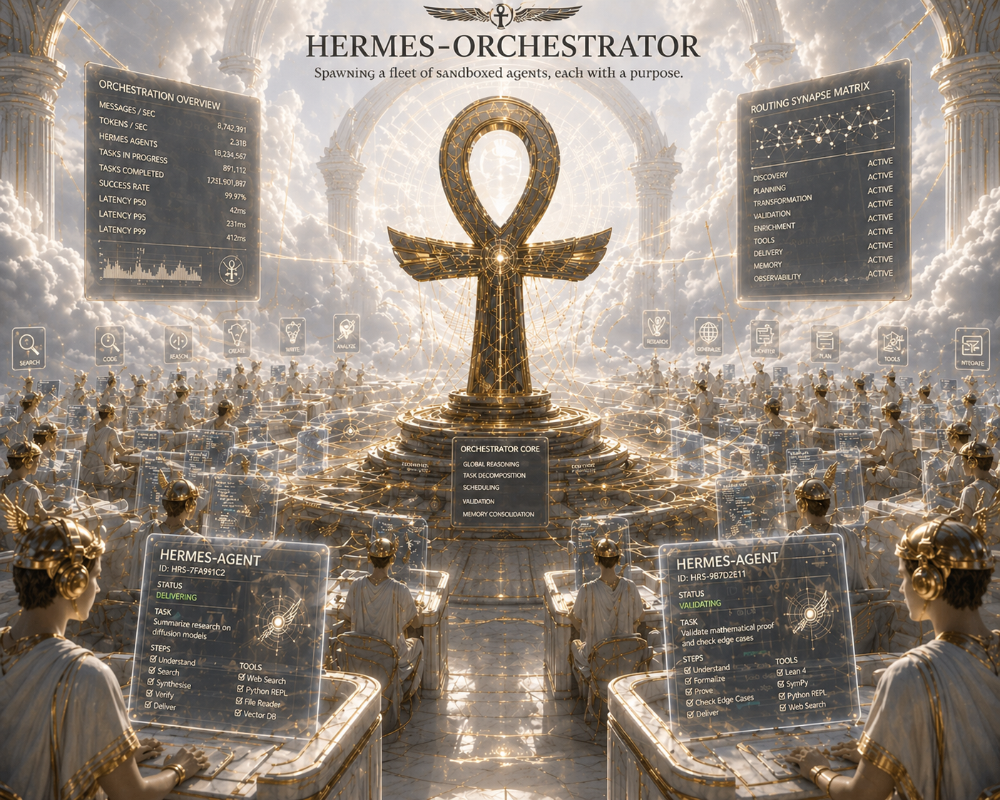
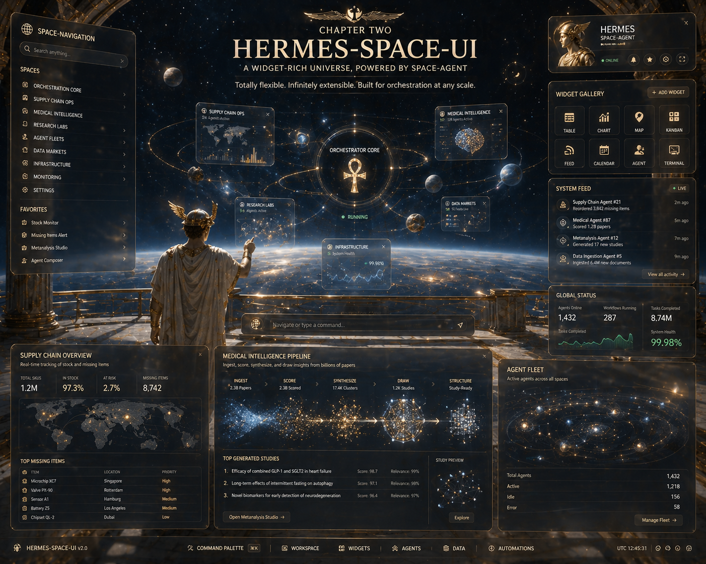
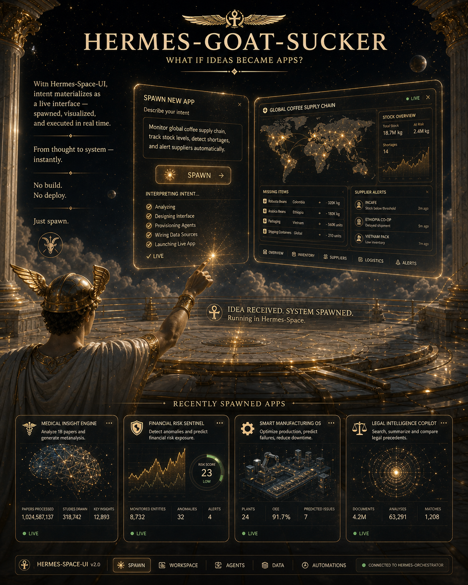
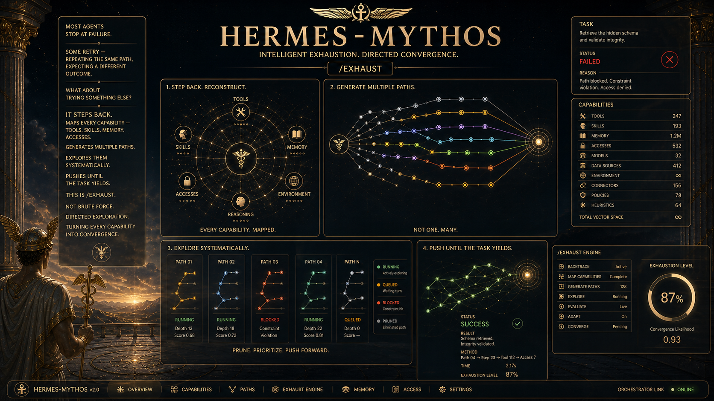

# Hermes-Symbiosis

Hermes-Symbiosis is an operating system for humans and agents.

▶ Demo: https://youtu.be/C1qffO8BVSQ  
✦ Thread: https://x.com/VictorDeGenaro/status/2050717028479058213  

Systems today are fragmented.
Agents live in scripts, dashboards, and isolated runtimes.

Symbiosis collapses that boundary.

Not a toolchain.
Not a UI.
Not a framework.

A unified runtime where orchestration, interface, and persistence
merge into a single living system.

## Arc

To make agents usable in the real world,
three constraints must be resolved:

coordination,
visibility,
and resilience.

Hermes-Symbiosis solves them as one system.

Anything less breaks at scale.

## Chapter 1: Hermes-Orchestrator

[Hermes-Orchestrator](https://github.com/Magaav/hermes-orchestrator)

Hermes-Orchestrator is the control plane.

It turns agents into a coordinated system:
nodes, plugins, memory, and workflows
moving as one runtime.

## Chapter 2: Hermes-Space-UI

[Hermes-Space-UI plugin](https://github.com/Magaav/hermes-orchestrator/tree/main/plugins/hermes-space-ui)

Hermes-Space-UI is the spatial cockpit.

Not dashboards.
Not logs.

A live interface into cognition —
where agents, tasks, and system state
can be seen, steered, and reshaped in real time.

This is where humans and agents share attention.

Through the Goat-Sucker app,
intent materializes as software.

Any wish —
a tool, a workflow, a system —
can be instantiated instantly
as a living interface.

Not built.
Not deployed.

Spawned.

## Chapter 3: Hermes-Mythos

[Hermes-Mythos through the Exhaust plugin](https://github.com/Magaav/hermes-orchestrator/tree/main/plugins/exhaust)

Hermes-Mythos is the persistence layer.

Most agents fail.
Some retry.

Hermes does not stop.
It adapts.
It reroutes.
It continues.

Through the Exhaust plugin,
it maps capabilities,
explores alternative paths,
and continues until the task yields —
or meaningfully degrades.

This is not retry logic.

It is directed convergence.

## Symbiosis

At small scale, this feels like control.
At large scale, it becomes autonomy.

Individually, these systems solve parts of the problem.
Together, they form a loop:

Orchestrator coordinates.
Space-UI reveals.
Mythos persists.

A system that can act,
observe itself,
and continue.

A system that does not break at the edge of its knowledge —
but expands beyond it.

Not a pipeline.
A living runtime.

---

## Where this is going

This system does not stop at running agents.

It is being designed to evolve itself.

The repository becomes executable:
roadmaps become resumable,
documentation becomes memory,
and agents extend the system that runs them.

Not users.

Co-authors of a living system.
